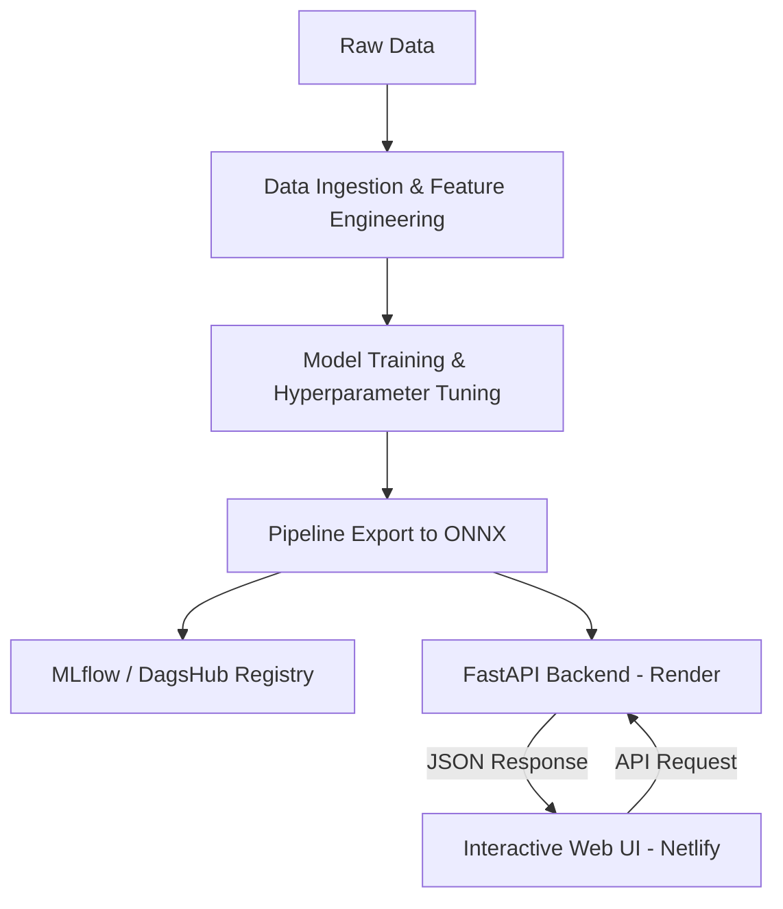

MLOPS PROJECT

# E-Commerce Delivery Delay Predictor (MLOps)

This project is an end-to-end MLOps pipeline designed to predict transit delay risks for e-commerce deliveries. It utilizes a trained **XGBoost Classifier** wrapped in a **Scikit-Learn Preprocessing Pipeline**, converts it to **ONNX format** for lightweight production deployment, and exposes it via a **FastAPI backend** paired with a **responsive web interface**.

---

## 🏗️ Architecture Overview

The system is decoupled into modular stages:



### 1. Data & Preprocessing Pipeline
* **Input Features**: Telemetry features such as `price`, `freight_value`, `product_category_name`, dimensions/weight (to calculate volumetric cargo indices), routing tags (`is_same_state`), and temporal contexts (purchase month, weekday, hour).
* **Preprocessing**: 
  * **Numeric**: Median imputation and Standard Scaling.
  * **Categorical**: One-Hot Encoding (OHE).

### 2. ONNX Model Optimization (`src/selected_model/XGB_model.py`)
* The raw Scikit-Learn pipeline (preprocessing + XGBoost) is trained on historical data.
* The pipeline is converted to **ONNX format** (`best_xgb_model_pipeline.onnx`) using `skl2onnx` and `onnxmltools`.
* Utilizing ONNX decouples the production inference service from heavy training frameworks (`scikit-learn` and `xgboost`), reducing container size and memory footprints.

### 3. FastAPI Backend (`APP/main.py`)
* A lightweight server loaded with `onnxruntime` to load and run predictions on the `.onnx` model.
* Serves a `/predict` JSON POST endpoint.

### 4. Interactive Frontend (`templates/`)
* A responsive dashboard displaying real-time predictions.
* Implements rich glassmorphism styles, slider-synced payload controls, custom speedometer gauge indicators, and local run log tracking.

---

## 🛠️ Local Development

### 1. Setting up Environment
Ensure you have Python 3.10+ and install dependencies:
```bash
python3 -m venv ml_venv
source ml_venv/bin/activate
pip install -r requirements.txt
```

### 2. Training and Exporting ONNX Model
To run feature engineering, train the model, convert it to ONNX, and log variables to MLflow:
```bash
PYTHONPATH=. python src/selected_model/XGB_model.py
```

### 3. Running Backend Locally
To start the Uvicorn web server locally:
```bash
python APP/main.py
```
The server will boot on `http://localhost:8000`. You can access automated API documentation at `http://localhost:8000/docs`.

---

## 🚀 Cloud Deployment

The project is structured for split-hosting (Frontend on Netlify, Backend on Render):

### 1. Backend (Render / Docker)
* The repository includes a multi-stage [Dockerfile](file:///home/likith/mlops/MLOPS/Dockerfile) that automatically builds the dependencies, copies the ONNX model, and runs the FastAPI server.
* Point your Render Web Service to your GitHub repo and select **Docker** as the runtime.

### 2. Frontend (Netlify)
* Deploys the static files inside the `templates/` folder.
* Simply drag and drop the `templates/` folder to Netlify, or link it to GitHub and configure the **Publish directory** as `templates`.
